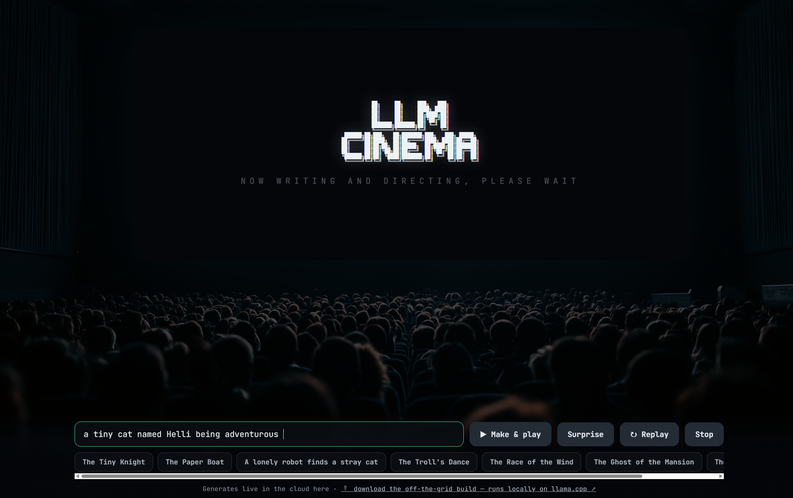
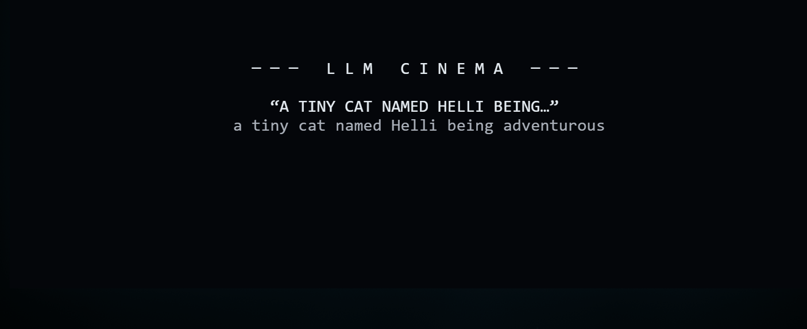
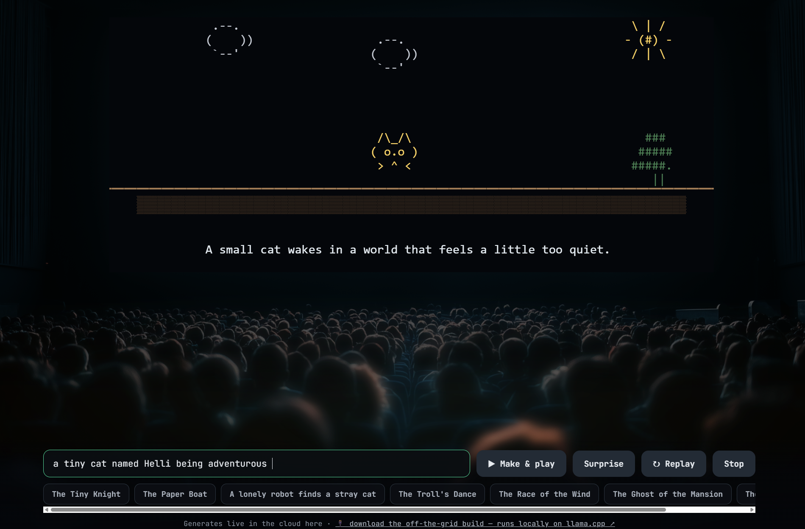

# 🎬 LLM Cinema

An interactive AI-powered cinema experience built with **Python** and **Gradio**, featuring a conversational movie interface and a modern web UI.

---

## ✨ Features

- Interactive cinema-themed experience
- AI-powered conversational interface
- Built with Python and Gradio
- Fast and lightweight
- Clean, modern user interface
- Responsive web application
- Customized with UI improvements and project enhancements

---

## 📸 Screenshots

<p align="center">
  
  <br>
  <em>You type in a prompt or use one of the sample prompts. Click on the make and play play button to see this</em>
</p>

<p align="center">
  
  <br>
  <em>LLM Cinema will try to make your short movie</em>
</p>

<p align="center">
  
  <br>
  <em>Sit back and enjoy your short movie!!</em>
</p>

---

## 🛠️ Tech Stack

- **Python**
- **Gradio**
- **Pillow**

---

## 🚀 Getting Started

### Clone the repository

```bash
git clone https://github.com/YOUR_USERNAME/llm-cinema.git
cd llm-cinema
```

### Create a virtual environment

```bash
python -m venv venv
```

### Activate the virtual environment

**Windows**

```bash
venv\Scripts\activate
```

**macOS/Linux**

```bash
source venv/bin/activate
```

### Install dependencies

```bash
pip install -r requirements.txt
```

### Run the application

```bash
python server_app.py
```

Then open:

```
http://127.0.0.1:7860
```

---


## 🛠️ Modifications

This repository includes my own improvements to the original project, including:

- UI refinements
- Local development setup
- Documentation improvements
- General code enhancements and customization

---

## 🤝 Acknowledgments

This project is inspired from the original **LLM Cinema** project from the Hugging Face Build Small Hackathon (Conductor Common Labs). Huge shoutout for Conductor Common Labs for giving such a wonderful project idea!

Project Preview:
https://build-small-hackathon-llm-cinema.hf.space/

---

## 📄 License

Please refer to the original project's license before redistributing or using this project commercially.
